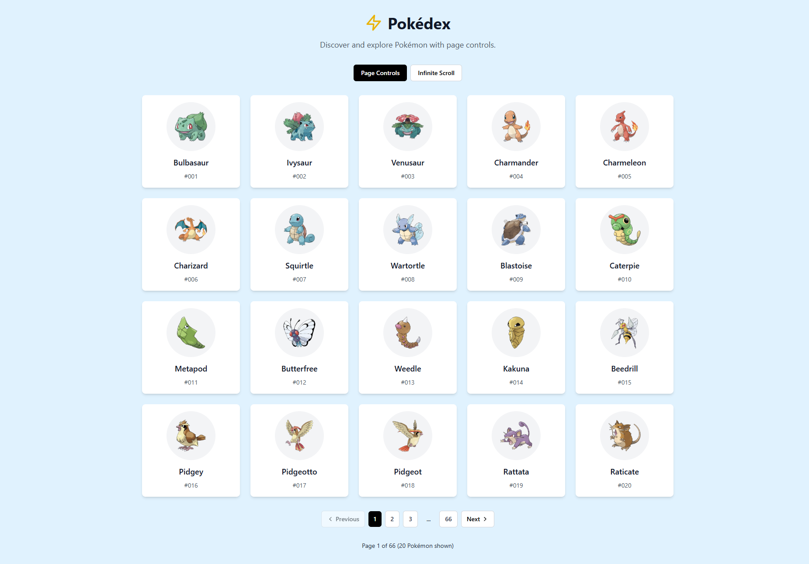
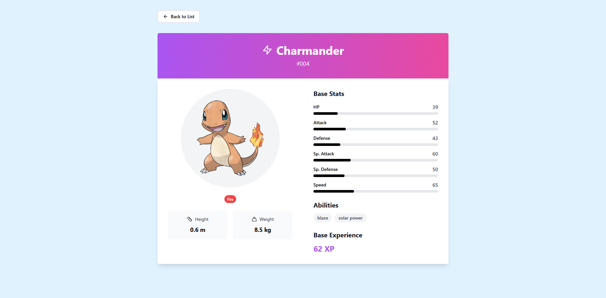

# Pokémon Browser

[](https://pokemon-browser-ochre.vercel.app/)

A responsive Pokémon browser built with React, TypeScript, and Tailwind CSS. This application allows users to browse Pokémon with two different viewing modes: pagination and load more functionality.

## 🖼️ Screenshots

<div align="center">
  <h3>Homepage - Pokemon List</h3>
  <a href="https://pokemon-browser-ochre.vercel.app/" target="_blank">
    
  </a>
  
  <h3>Pokemon Detail Page</h3>
  <a href="https://pokemon-browser-ochre.vercel.app/" target="_blank">
    
  </a>
  
  <p><em>Click any image to view the live demo</em></p>
</div>

## Features

- **Two View Modes**: Switch between pagination and infinite scroll ("Load More") views
- **Pokémon Detail Pages**: Comprehensive Pokémon information with high-quality artwork
- **Responsive Design**: Optimized for desktop, tablet, and mobile devices
- **Advanced Loading States**: Suspense boundaries, loading spinners, and error boundaries
- **Type Safety**: Full TypeScript support with comprehensive type definitions
- **Modern UI**: Clean, modern design with Tailwind CSS and smooth animations
- **SEO Optimized**: React Helmet for dynamic meta tags and page titles
- **Code Splitting**: Lazy-loaded pages for optimal performance
- **Error Handling**: Graceful error states with retry functionality
- **Base Stats Visualization**: Interactive stat bars with animations
- **Pokémon Type Styling**: Color-coded type badges with custom styling

## Tech Stack

- **React 18** - Modern React with hooks and Suspense
- **TypeScript** - Full type safety and better developer experience
- **Tailwind CSS** - Utility-first CSS framework with custom Pokemon styling
- **React Router v6** - Client-side routing with future flags
- **TanStack Query v5** - Advanced data fetching, caching, and infinite queries
- **React Suspense** - Declarative loading state management
- **React Helmet Async** - Dynamic meta tags and SEO optimization
- **Error Boundaries** - Graceful error handling and recovery
- **Vite** - Lightning-fast build tool and development server
- **Lucide React** - Beautiful, customizable icons
- **clsx** - Conditional CSS class utility

## Architecture Decisions

### Why React Query Instead of React Server Components (RSC)?

This project uses **TanStack Query (React Query)** for data fetching instead of React Server Components (RSC) for the following reasons:

#### **React Query Benefits for This Use Case:**

- ✅ **Client-side caching** - Instant responses for pagination and interactions
- ✅ **Background refetching** - Keeps data fresh without user intervention
- ✅ **Optimistic updates** - Smooth user experience during data mutations
- ✅ **Retry logic** - Automatic retry on failed requests
- ✅ **Loading states** - Granular control over loading indicators
- ✅ **Perfect for SPAs** - Ideal for interactive applications with user-driven navigation

#### **Why Not RSC:**

- ❌ **RSC requires Next.js** - This project uses Vite for faster development
- ❌ **Server-side rendering** - Not needed for this client-side Pokémon browser
- ❌ **Less interactive** - RSC is better for content-heavy sites, not interactive apps
- ❌ **Complex setup** - Would require significant architectural changes

#### **Result:**

The combination of **React Query + Suspense + Error Boundaries** provides a superior user experience for this interactive Pokémon browser, with instant responses to user interactions and robust error handling.

## Getting Started

### Prerequisites

- Node.js (version 16 or higher)
- pnpm (recommended) or npm

### Installation

1. Clone the repository:

```bash
git clone <repository-url>
cd pokemon-browser
```

2. Install dependencies:

```bash
pnpm install
```

3. Start the development server:

```bash
pnpm dev
```

4. Open your browser and navigate to `http://localhost:5173`

## Project Structure

```
src/
├── api/                # API layer with organized functions
│   ├── pokemon.ts      # Pokémon API functions
│   └── index.ts        # API exports
├── hooks/              # Custom React Query hooks
│   ├── useGetPokemonList.ts       # Paginated Pokemon list hook
│   ├── useGetPokemonListInfinite.ts # Infinite scroll Pokemon list hook
│   ├── useGetPokemonById.ts       # Individual Pokemon by ID hook
│   ├── useGetPokemonByName.ts     # Pokemon search by name hook
│   └── index.ts                   # Hooks exports
├── utils/              # Utility functions
│   ├── pokemon.ts      # Pokémon-specific utilities
│   ├── common.ts       # Common utility functions
│   └── index.ts        # Utils exports
├── constants/          # Application constants
│   └── index.ts        # All constants and configuration
├── components/          # Reusable UI components
│   ├── Layout.tsx              # Main layout wrapper with navigation
│   ├── PokemonCard.tsx         # Individual Pokémon card component
│   ├── PokemonListItem.tsx     # Optimized list item for grid display
│   ├── Pagination.tsx          # Pagination controls with page numbers
│   ├── ViewToggle.tsx          # Toggle between pagination/infinite scroll
│   ├── BaseStats.tsx           # Interactive base stats visualization
│   ├── LoadingSpinner.tsx      # Custom loading spinner component
│   ├── ErrorMessage.tsx        # Error display with retry functionality
│   ├── ErrorBoundary.tsx       # Error boundary wrapper component
│   ├── SuspenseFallback.tsx    # Suspense fallback component
│   └── index.ts                # Component exports
├── pages/              # Page components
│   ├── HomePage.tsx    # Main Pokémon listing page
│   └── PokemonDetailPage.tsx
├── types/              # TypeScript type definitions
│   ├── pokemon.ts      # Pokémon domain types
│   ├── props.ts        # Component props types
│   ├── hook-types.ts   # Hook type definitions
│   ├── api.ts          # API function types
│   └── index.ts        # Centralized type exports
└── App.tsx             # Main app component
```

## API Integration

This application uses the [PokéAPI](https://pokeapi.co/) to fetch Pokémon data:

- **List Pokémon**: `GET /api/v2/pokemon?limit=10&offset=0`
- **Pokémon Details**: `GET /api/v2/pokemon/{id}`

### API Structure

The API layer is organized in the `src/api/` folder following best practices:

- **`pokemon.ts`**: Contains all Pokémon-related API functions
- **`index.ts`**: Centralized exports for clean imports
- **Named functions**: Each endpoint has a descriptive function name (e.g., `fetchPokemonList`, `fetchPokemonById`)
- **TypeScript support**: Full type safety with proper return types
- **Error handling**: Consistent error handling across all API calls
- **useQuery integration**: Functions are designed to work seamlessly with React Query

### Custom React Query Hooks

The application uses custom React Query hooks for better code organization and reusability:

- **`useGetPokemonList`**: Fetches paginated Pokémon lists with caching and error handling
- **`useGetPokemonListInfinite`**: Handles infinite scroll functionality with automatic pagination
- **`useGetPokemonById`**: Fetches individual Pokémon details by ID
- **`useGetPokemonByName`**: Fetches Pokémon details by name (for search functionality)

## Features Overview

### Pagination View

- Displays Pokémon in a responsive grid layout (1-5 columns based on screen size)
- Includes pagination controls with page numbers and navigation
- Shows 20 Pokémon per page with smooth transitions
- Auto-scrolls to top when changing pages
- Page information display (e.g., "Page 2 of 50")

### Infinite Scroll View

- Displays Pokémon in the same responsive grid layout
- "Load More" button to append next batch of Pokémon
- Maintains all previously loaded Pokémon in memory
- Shows loading state during fetch operations
- Displays total count of loaded Pokémon

### Detail Page

- **Comprehensive Information**: Complete Pokémon data with high-quality artwork
- **Physical Stats**: Height and weight with proper unit conversion
- **Type Information**: Color-coded type badges with custom styling
- **Base Stats Visualization**: Interactive stat bars with animations
- **Abilities**: Complete list of Pokémon abilities
- **Base Experience**: XP display with custom styling
- **SEO Optimization**: Dynamic meta tags and page titles
- **Error Handling**: Graceful fallback for missing images
- **Navigation**: Easy return to main list

### Advanced Features

- **Code Splitting**: Lazy-loaded pages for optimal performance
- **Suspense Boundaries**: Declarative loading states
- **Error Boundaries**: Graceful error recovery
- **Responsive Design**: Optimized for all device sizes
- **Accessibility**: Proper ARIA labels and keyboard navigation
- **Performance**: Optimized with React Query caching and background updates
